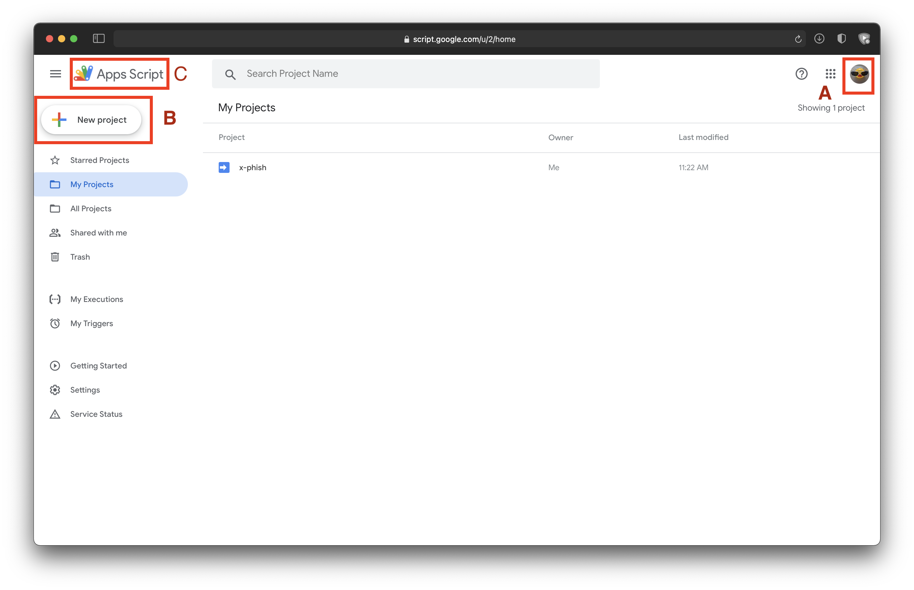
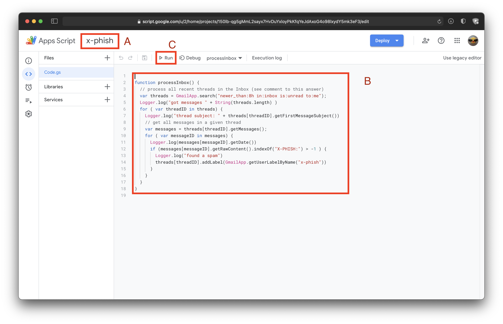
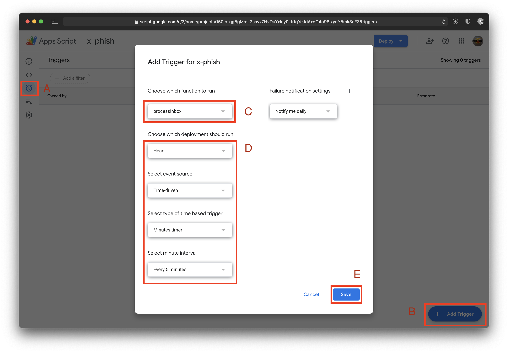

# Defeat Infosec Phishing Sims

It is critically important you look at every incoming email with suspicion.
Every new thread is potentially not from a legit source.
It could be from a customer, and could be an attempt ot get confidential information.
It could also be an attempt at getting credentials, or funds, or leverage against you.
There may even be a fake thread in that email that could pull you along.

Thus, it is critically important that you be mindful of phishing emails.

Phishing sims are equally important to email security.
They are test emails that are sent to see if you are capable of spotting a fraud.
However, they're also annoying, and overblown as of late.

This guide will help you beat Liquid Web InfoSec Phishing Simulations.

## Setup Script to Handle Phishing Sims

All of this has to be done with Google App Scripts.
Open this dashboard with this URL.

> [https://script.google.com](https://script.google.com)



- A) Check to ensure that you are on the right account. Do this every time a page loads.
- B) Click here to create a new project. It will be renamed later.
- C) Click this button to get back to this overview page whenever you want.

Click on B to create a new project, then possibly click that project to open it.
Next, on the code editing screen, here's a picture of that.



- A) Click A and rename the project as you would like. I've named my `x-phish`.
- B) Click into the code area and paste the below code.
- C) Click the disk icon next to C to save, click C to run it. You will be prompted for permissions on first run.

```javascript
function processInbox() {
  // process all recent threads in the Inbox (see comment to this answer)
  var threads = GmailApp.search("newer_than:2h in:inbox is:unread to:me");
  for ( var threadID in threads) {
    // get all messages in a given thread
    var messages = threads[threadID].getMessages();
    for ( var messageID in messages) {
      if (messages[messageID].getRawContent().indexOf("X-PHISH:") > -1 ) {
        Logger.log("found a spam: " + threads[threadID].getFirstMessageSubject())
        threads[threadID].addLabel(GmailApp.getUserLabelByName("x-phish"))
        // this could work, but it could be a bounce loop if they reply
        // messages[messageID].forward("secteam@liquidweb.com",
        //  {htmlBody: 'looks like another phish<br><hr><br>'})
        threads[threadID].markRead()
        threads[threadID].moveToSpam()
      }
    }
  }
}
```

Note, this script requires that you keep your inbox fairly empty and unread.
You should be doing that anyawy.

This script actually forwards the email to secteam, and attaches this image:


Reference for libaries used:
[https://developers.google.com/apps-script/reference/gmail/gmail-thread](https://developers.google.com/apps-script/reference/gmail/gmail-thread)

Finally, once this has run once successfully, you have to schedule it to happen automatically.



- A) Click this to get to this screen.
- B) Click this to open this popup modal and set it up.
- C) Choose your function name, if you pasted exactly it is the same as mine.
- D) Probably just make these match mine. Specifically:
  - Time driven event source.
  - You want minute based timers.
  - Run it every 5 minutes. Or 1 minute if you really stay on top of your email.

Do note, if you do not stay on top of your mailbox,
if you set your timing down to 1 minute and it takes > 1 minute to script through your mail.
It's possible a incoming message ends up in 2 distinct runs of this script.
That will cause unexpected weird behavior.
